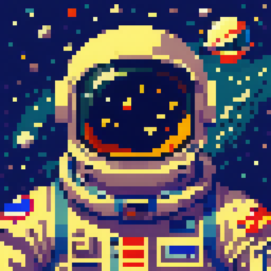
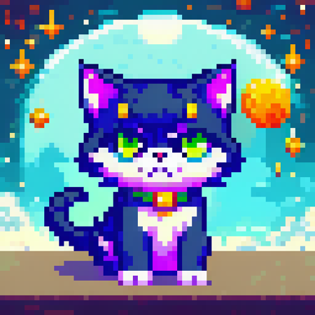
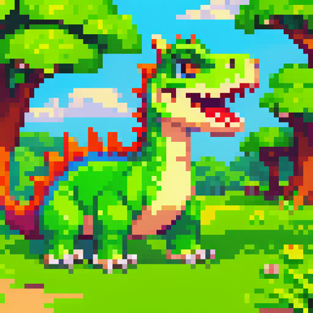
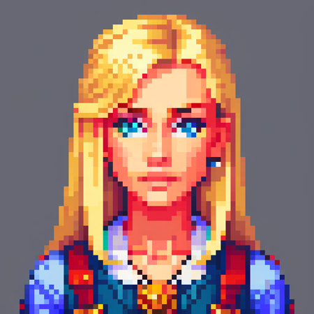
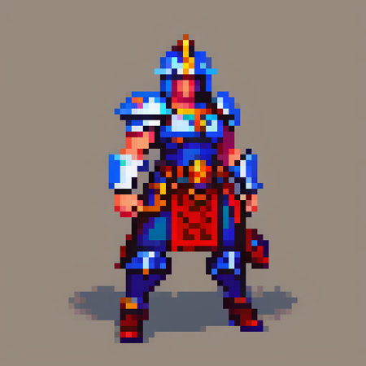
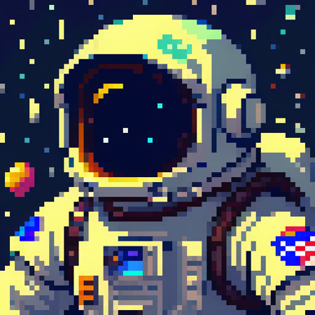
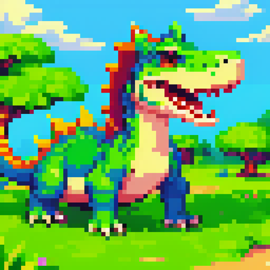
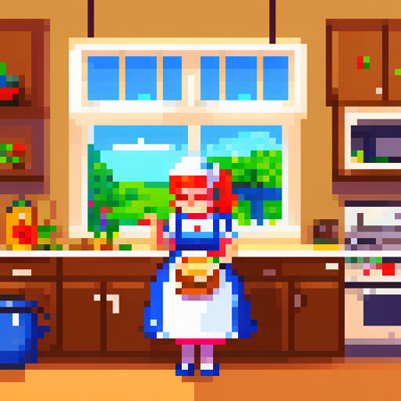
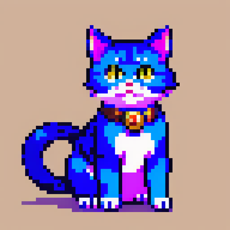

# PixelArtRedmond 1.5V- Pixel Art Loras for SD 1.5! 

<Gallery />

<h1 id="heading-28">PixelArt.Redmond 1.5V for SD here is here!</h1>
Introducing PixelArt.Redmond 1.5V for SD 1.5, the ultimate LORA for creating Pixel Art images!

This is the first in a series of Loras that I'll be releasing on Pixel Art. Expect more Loras soon.

I'm grateful for the GPU time from <strong>Redmond.AI</strong> that allowed me to make this LORA! If you need GPU, then you need the great services from <a target="_blank" rel="ugc" href="http://Redmond.AI">Redmond.AI</a>.

Test all my Loras <a target="_blank" rel="ugc" href="https://huggingface.co/spaces/artificialguybr/artificialguybr-demo-lora">here</a> for free and unlimited. Thanks, HF, for Inference API!

It is based on <strong>SD 1.5 using Liberte Model</strong> and fine-tuned on a large dataset<strong>.</strong>

The LORA has a high capacity to generate Coloring Book Images!
<h3 id="heading-38"><strong><u>The tag for the model: Pixel Art, PixArFK</u></strong></h3>
<strong><u>Use Pixel Art Extension to have better results and more pixel-perfect images. Downscale it by 4 or 8.</u></strong>

I really hope you like the LORA and use it.

If you like the model and think it's worth it, you can make a donation to my Patreon or Ko-fi.

Patreon:

<a target="_blank" rel="ugc" href="https://www.patreon.com/user?u=81570187">https://www.patreon.com/user?u=81570187</a>

Ko-fi:<a target="_blank" rel="ugc" href="https://ko-fi.com/artificialguybr">https://ko-fi.com/artificialguybr</a>

BuyMeACoffe:<a target="_blank" rel="ugc" href="https://www.buymeacoffee.com/jvkape">https://www.buymeacoffee.com/jvkape</a>

Follow me in my twitter to know before all about new models:

<a target="_blank" rel="ugc" href="https://twitter.com/artificialguybr/"><u>https://twitter.com/artificialguybr/</u></a>

## Image examples for the model:

> A astronaut on space
, pixel art, PixArFK,

> A super cat hero,
, pixel art, PixArFK,

> A cute dinossaur,
, pixel art, PixArFK,

> Beautiful blonde girl, stunning, detailed, portrait,
, pixel art, PixArFK,

> A warrior, game asset, detailed
, pixel art, PixArFK,

> A astronaut on space
, pixel art, PixArFK,

> A cute dinossaur,
, pixel art, PixArFK,

> A highly detailed mother in her kitchen preparing meal, window sunny day, happy, smiling,
, pixel art, PixArFK,

> A super cat hero,
, pixel art, PixArFK,

